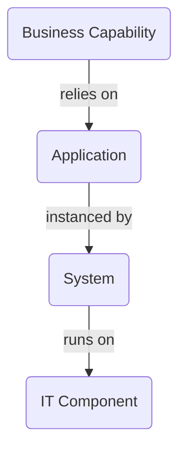
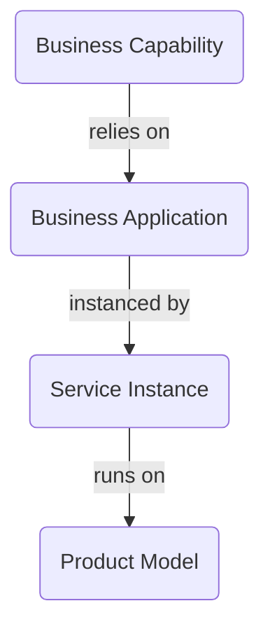
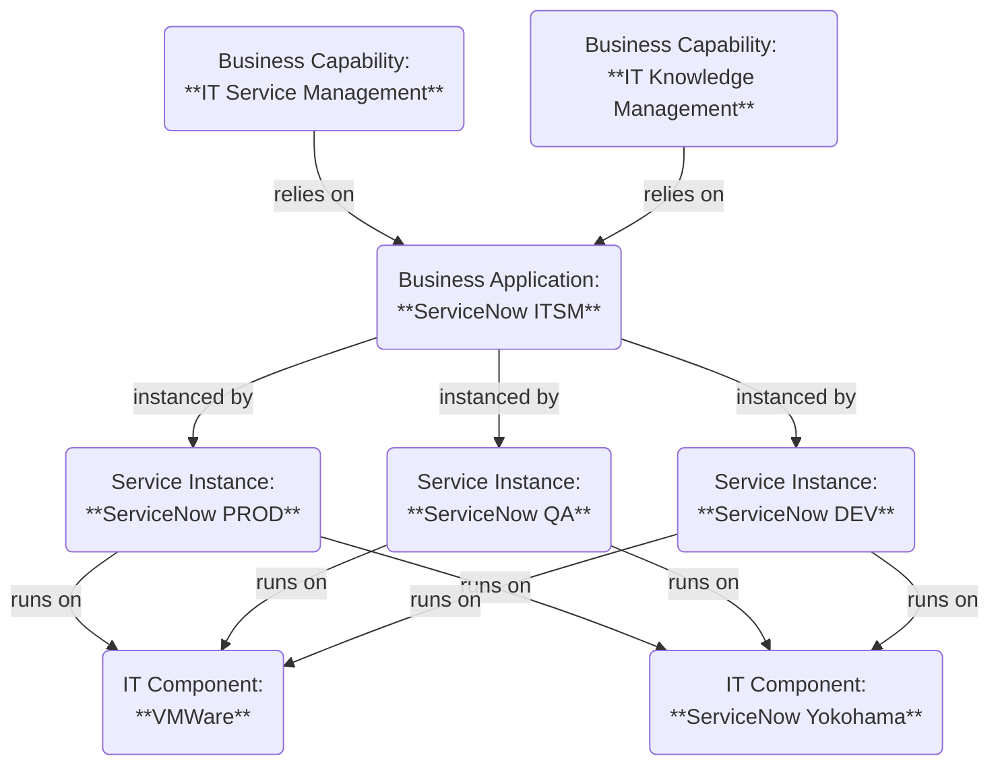

I'm currently exploring enterprise architecture from a new perspective. I'm a data and relationship nerd and always want to bring systems and data streams together, ideally having systems defined where you can jump back and forth between the leading data systems.

ServiceNow usually is a system of action which has a good workflow layer and relies heavily on data from other systems to bring this data to workflows and enhance or exchange data properly in an ordered way. However, ServiceNow itself is not only a system of action there is a huge area in ServiceNow that contains data either created on the platform or by bringing data from other systems into context. This is usually the CMDB, in most cases from an IT perspective.

But with the CSDM model, nowadays in version 5, there is more to technical and service orientation. You can bridge the gap properly between operations and strategic planning including a relation to the business view. All of this is supported by the CSDM model and also part of the enterprise architecture capability, ITSM and ITOM if you want to combine operations with strategic planning in the ServiceNow ecosystem.

But like in my case there are other tools already established and seen as best of breed solution in companies like SAP LeanIX. The three letters "SAP" usually indicated that a lot of companies jump onto the LeanIX tool as well because they all trust their ERP solution from that vendor as well.

So I stepped deeper into LeanIX and also the capability of integrating LeanIX with ServiceNow. In this post I want to share some of my current thoughts.

## LeanIX as high level view to provide information to the CSDM Design phase

If you are not yet familiar with the CSDM model there is a good [white paper](https://www.servicenow.com/community/common-service-data-model/csdm-5-finally-get-the-csdm-5-white-paper-here/ta-p/3254967) available from ServiceNow that explains the concept. Or you can watch some Youtube videos in the ServiceNow community channel that explains the model including some examples. I don't want to stress the CSDM concept in this article so grab some coffee and have a good read or enjoy a video.

I want to dig deeper into the LeanIX data model and how it can help with CSDM and how CSDM can also enrich LeanIX with the data that should be maintained in ServiceNow instead of LeanIX.

As an example for modelling I will use the platform I'm most familiar with: ServiceNow!

Let's start with factsheets (data in LeanIX) that we will have in focus for this current discussion:

1. Business Capability
2. Application
3. System
4. IT Component

These four fact sheets are part of the LeanIX data model and the center of everything in LeanIX is the Application factsheet. The relation is quite simple:

A similar relationship picture is within CSDM as well if we take a look at these tables:

1. Business Capability
2. Business Application
3. Service Instance
4. Product Model

If we take that relationship picture and model it for a typical ServiceNow environment this could mean something like this:

This is a rough idea how LeanIX and ServiceNow could play together. In this example we can also define different leading systems for the data information. This is up to each company how they want to use the tools but if we follow the proposal of the default ServiceNow integration it would look like this from a LeanIX perspective:

||LeanIX|ServiceNow|
|-|-|-|
|Business Capability|x||
|(Business) Application|x||
|Service Instance / System||x|
|Product Model / IT Component||x|

The main reason why I would follow this approach is that the first two parts are mainly from a design perspective and how your high level environment runs the company. The last two parts are more from an operation perspective and that usually resides in the CMDB.

You can even bring this further and e.g. break down the IT components then in ServiceNow where you can see the relationship between the real configuration items related to the product model that are used to run the Service Instance.

Based on that you can drive this always a step further but should keep in mind what should be in what system. I would never recommend to model or sync the CIs into LeanIX. That is operational data Enterprise Architecture usually shouldn't care about. It is important for operations or for understanding transformation projects if you want to streamline your application landscape but that is usually the step where you anyhow involve service and product owners which are living in the operational world most of their time.

## What am I doing now with this information?

That is up to you but for me this is a whole new world of bridging the gap between business speech and tactical/strategic discussion and operations. You could e.g. either use LeanIX to manage initiatives or projects factsheets in LeanIX and relate this to applications or use ServiceNow SPM to have the relation to service instances. Both worlds combined will help each other in different stakeholder discussions.

You could even think about integrating the initiative/project factsheet with demands and projects as well so that both systems are kept up to date. In addition you can use both systems to maintain data, even on the same factsheet (what I would not recommend yet). 

With this integration and information you can start transforming discussions of your current towards future application landscape with the power of LeanIX and the clustering/reporting parts in LeanIX. And from there you can bring it down to real projects where the teams can leverage the data to understand what is running the different applications and what needs to be recognized in the transformation project.

Or you can use this data for a potential risk view in enterprise architecture. You could e.g. check on outdated IT components or IT components that do not fit the future state you want to transform your IT into, like getting rid of old SQL databases because the strategy is going with another database technology. If you sync the product models to IT components you can easily identify the applications that are still running on these components and use this information for your future state planning.

A lot of capabilities if you have both tools and don't want to bring EA into ServiceNow. I haven't checked out the capabilities of that yet so I can't say if it ServiceNow would be a potential replacement of LeanIX, this was just thought as inspiration how you can use the various data worlds in a company and bring them together.